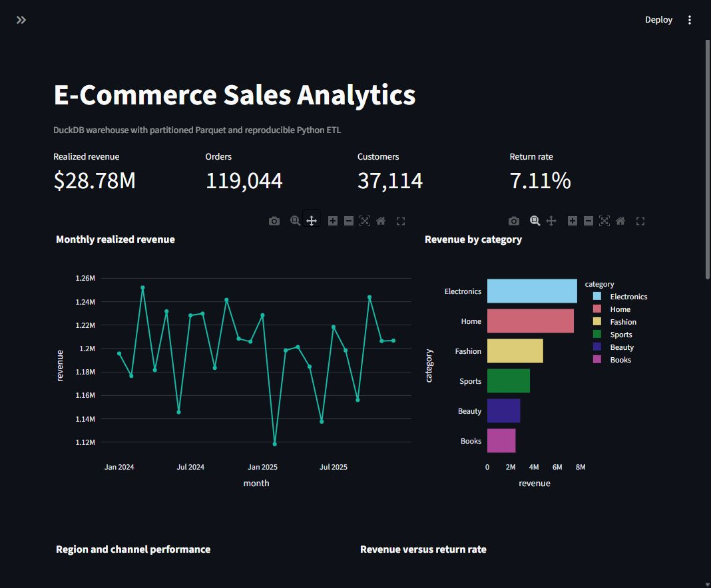
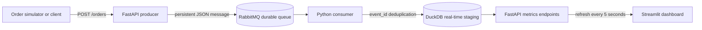

# E-Commerce Sales Analytics using DuckDB

This practical case study implements a local analytical data platform with Python, SQL, DuckDB, CSV, Parquet, Streamlit, FastAPI, RabbitMQ, Docker, and Kubernetes.



## Submission deliverables

- [Case study report (PDF)](docs/ECommerce_Sales_Analytics_DuckDB_Report.pdf)
- [Technical presentation deck (12 slides, four-presenter split)](docs/ECommerce_Data_Engineering_RabbitMQ_Technical_Presentation.pptx)
- [Captured charts, KPI tables, query plans, and API metadata](evidence/)
- Reproducible Python/SQL source code, test, Dockerfile, and Kubernetes manifests

## Practical-guideline coverage

| Requirement from the brief | Implementation evidence |
|---|---|
| Set up Python environment | Pinned `requirements.txt`, quick-start commands, Windows/Linux launchers |
| Load CSV / JSON / API | Generated CSV plus a current DummyJSON products-and-carts API snapshot |
| Perform data processing | DuckDB cleaning, validation, rejection handling, and a star schema |
| Apply transformations and actions | Derived revenue fields, dimensions, KPI views, joins, windows, CUBE, ROLLUP, and GROUPING SETS |
| Optimize performance | ZSTD Parquet partitions, DuckDB indexes, thread controls, and `EXPLAIN ANALYZE` plans |
| Capture results | Versioned dashboard screenshot, plots, KPI JSON/CSV, and plans in `evidence/` |
| Analyze performance | CSV vs Parquet vs DuckDB benchmark at 1 and 4 threads |
| Report, code, and PPT | PDF report, documented source code, and a 10-slide presentation |
| Bonus: real-time dataset / API | Validated FastAPI order events, durable RabbitMQ queue, idempotent consumer, and live DuckDB metrics |
| Bonus: Kubernetes | Dashboard, API/consumer, RabbitMQ, simulator, Service, PVC, probes, HPA, and Kustomize configuration |
| Bonus: compare execution modes | Storage-format and thread-count benchmark with an explicitly stated local-OLAP scope |

## What the project demonstrates

- Generates a reproducible e-commerce CSV containing realistic data-quality defects.
- Cleans types, nulls, duplicates, invalid ranges, and inconsistent categories in DuckDB SQL.
- Models a star schema with `fact_sales`, `dim_customer`, `dim_product`, and `dim_date`.
- Creates reusable KPI views for revenue, monthly growth, repeat customers, and returns.
- Runs joins, aggregations, windows, `ROLLUP`, `CUBE`, and `GROUPING SETS`.
- Exports partitioned ZSTD Parquet and records `EXPLAIN ANALYZE` plans.
- Benchmarks CSV, partitioned Parquet, and DuckDB tables with 1 and 4 threads.
- Builds a Streamlit dashboard with filters and decision-focused charts.
- Ingests a current public API snapshot from DummyJSON as a bonus extension.
- Streams validated order events through RabbitMQ into an idempotent DuckDB staging table.
- Refreshes live event metrics and recent orders in Streamlit every five seconds.
- Includes Docker Compose and Kubernetes deployments for the complete streaming path.

## Real-time architecture



The API and consumer run in one service by default so a single process owns the real-time DuckDB file. Producer and consumer remain separate components in the code. The publisher requests broker confirms, the consumer acknowledges only after a successful insert, and `event_id` provides idempotency.

## Quick start

### Windows one-click startup

Double-click `Start_ECommerce_Platform.cmd`, or use the **Start E-Commerce Analytics.cmd** wrapper placed on the Desktop. The launcher prefers the complete RabbitMQ real-time stack, verifies its health, and opens the dashboard. If Docker Desktop cannot provide its Linux engine, it explicitly falls back to the historical DuckDB dashboard instead of claiming streaming is active. See [STARTUP_GUIDE.md](STARTUP_GUIDE.md) for modes, URLs, diagnostics, and shutdown instructions.

Run a read-only startup audit at any time:

```powershell
.\Start_ECommerce_Platform.ps1 -CheckOnly
```

### Manual Python startup

Create and activate a Python 3.11+ virtual environment, then run:

```bash
pip install -r requirements.txt
python -m src.cli all --rows 250000
streamlit run src/dashboard.py
```

Open `http://localhost:8501`.

The `all` command writes the generated CSV to `data/raw`, the DuckDB database and Parquet dataset to `artifacts`, and charts, query outputs, logs, and benchmark evidence to `results`.

## Commands

```bash
python -m src.cli generate --rows 250000 --seed 42
python -m src.cli build
python -m src.cli analyze
python -m src.cli benchmark --runs 5
python -m src.cli api-ingest
python -m src.cli all --rows 250000
```

Use a different input file:

```bash
python -m src.cli build --input path/to/orders.csv
```

The replacement CSV should contain the columns listed in `src/config.py` under `RAW_COLUMNS`.

## Strict real-time demonstration

Start RabbitMQ, the API/consumer, the dashboard, and the continuous producer:

```bash
docker compose --profile demo up --build
```

Then open:

- Dashboard: `http://localhost:8501`
- FastAPI documentation: `http://localhost:8000/docs`
- RabbitMQ management: `http://localhost:15672` (`ecommerce` / `ecommerce-demo`)

The simulator sends one new order per second. The API returns HTTP 202 after RabbitMQ confirms the event. The consumer validates it again, inserts it into `streaming.order_events`, acknowledges the message, and ignores duplicate event IDs. The live section of the dashboard refreshes every five seconds.

To run a finite demonstration instead of the continuous Compose profile:

```bash
docker compose up --build rabbitmq realtime-api dashboard
python -m src.realtime.simulator --events 50 --interval 0.5
curl http://localhost:8000/metrics
curl "http://localhost:8000/orders/recent?limit=10"
```

## Dashboard questions

1. How are revenue and order volume changing by month?
2. Which categories produce the most realized revenue?
3. Which regions and channels are underperforming?
4. Which categories have the highest return rate?
5. How concentrated is revenue among the top customers?

## Bonus work

### Public API snapshot

```bash
python -m src.cli api-ingest
```

This calls the DummyJSON products and carts endpoints, preserves the raw JSON response, flattens cart items to CSV, and loads the snapshot into the DuckDB table `api_cart_items` when the database exists.

### Event-driven order ingestion

The real-time path is stricter than API polling: every submitted order becomes a persistent RabbitMQ message and passes through a consumer before reaching the staging table. Invalid API payloads return HTTP 422. Invalid queued messages go to `results/logs/realtime_dead_letters.ndjson`, and transient database failures are requeued.

### Kubernetes

```bash
docker build -t ecommerce-duckdb:1.0 .
kubectl apply -k kubernetes/
kubectl -n ecommerce-analytics port-forward svc/ecommerce-duckdb 8501:80
kubectl -n ecommerce-analytics port-forward svc/realtime-api 8000:8000
```

The manifests deploy RabbitMQ, a demo credential Secret, the API with its embedded consumer, a continuous event simulator, and the dashboard. HTTP and broker probes verify health. The PVC persists both DuckDB databases. Replace the demonstration Secret before using the manifests outside a classroom environment. The HPA requires the Kubernetes Metrics Server.

### Performance modes

The benchmark varies both storage format and DuckDB thread count. DuckDB is an in-process OLAP database, so these are scale-up execution modes rather than distributed cluster modes. The comparison remains directly relevant to the selected DuckDB case-study topic.

## Project structure

```text
src/                 Python pipeline, analytics, benchmark, dashboard, CLI
src/realtime/        FastAPI producer, RabbitMQ consumer, simulator, validation, staging store
sql/                 Schema, views, analytical SQL, and OLAP patterns
tests/               Reproducible smoke test
kubernetes/          Kubernetes manifests and Kustomize file
docker-compose.yml   Complete local real-time stack
data/                 Generated or API source data (created at runtime)
artifacts/            DuckDB and partitioned Parquet (created at runtime)
results/              Query outputs, plots, plans, metrics, and logs
evidence/             Curated, version-controlled output evidence
docs/                 Final report and presentation
```

## Data note

The historical dataset is synthetic and deterministic so the implementation runs without credentials or a large download. It intentionally contains missing values, duplicates, invalid quantities, and inconsistent text values. The live simulator generates new order events for a controlled streaming demonstration, while the DummyJSON extension supplies a current public API snapshot. None of these sources represents a real company's financial results.
